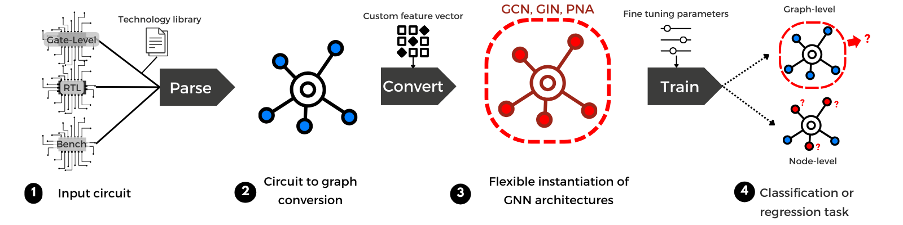

# GNN4CIRCUITS

GNN4CIRCUITS is a platform for applying Graph Neural Networks (GNNs) to circuit analysis and design. This repository supports graph conversion from hardware description files and the training of GNN models for both **node-level** and **graph-level** classification.

## Table of Contents

- [Overview](#overview)
- [Installation](#installation)
- [Usage](#usage)
  - [Convert a netlist to graph format](#graph-conversion)
  - [Training and evaluation](#graph-classification)
- [Command-Line Arguments](#command-line-arguments)

## Overview

Modern ICs can be represented as graphs, with gates as nodes and wires as edges. GNN4CIRCUITS leverages this structure to provide:

- Circuit-to-graph conversion 
- Node and graph-level machine learning tasks
- Multiple GNN model support (GCN, GIN and PNA)
- Compatibility with real-world and synthetic benchmarks

<p align="center">
  
</p>

## Installation

### Prerequisites

- [Miniconda](https://docs.conda.io/en/latest/miniconda.html) or [Anaconda](https://www.anaconda.com/products/distribution)
- Git

### Setup Instructions

1. **Clone the repository:**

   ```bash
   git clone https://github.com/hanasel/GNN4CIRCUITS.git
   cd GNN4CIRCUITS
   ```

2. **Create the conda environment:**

   ```bash
   conda env create -f gnn4circuits.yml
   ```

3. **Activate the environment:**

   ```bash
   conda activate gnn4circuits
   ```

## Usage

### Convert a netlist to graph format

Convert Verilog, Bench, or RTL files into graph format:

```bash
python GNN4CIRCUITS.py parse -ver <path-to-verilog> -hw <GL|RTL|BENCH> -class graph -lib <optional-lib-path> [feature flags]
```

#### Example:

```bash
python GNN4CIRCUITS.py parse -ver designs/ -hw GL -class graph -lib lib.v -id -od -gt -pi -po
```

This generates a directory called `files4training` containing:
- `node_features.csv`
- `graph_edges.csv`
- `graph_properties.csv`

### Training and evaluation

Once graph files are generated, train a GNN model on the dataset:

```bash
python GNN4CIRCUITS.py train -class graph -model <model> -hdim <hidden-dimension> -n_layers <number-of-layers> -epochs <number-of-epochs> -input <input-path>
```

Optional arguments can be used to provide validation or test sets separately using `-val` and `-test`.

#### Example:

```bash
python GNN4CIRCUITS.py train -class graph -model GIN -hdim 128 -n_layers 3 -epochs 200 -input files4training
```

## Command-Line Arguments

### `parse` Command 
Used for netlist to graph conversion
- `-ver`: Path to the Verilog or directory of files.
- `-hw`: Hardware type (`GL`, `RTL`, `BENCH`, `TXT`).
- `-class`: Classification type (`graph` or `node`).
- `-lib`: Optional library file for gate-level parsing.
- Optional Feature Flags:
  - `-id`: Input degree
  - `-od`: Output degree
  - `-iod`: I/O degree
  - `-mdi`: Min. dist. to input
  - `-mdo`: Min. dist. to output
  - `-pi`, `-po`: Primary I/O flags
  - `-gt`: Gate type

### `train` Command
Used for training and evaluation
- `-class`: `graph` or `node`
- `-model`: `GCN`, `GIN`, or `PNA`
- `-hdim`: Hidden dimension size
- `-n_layers`: Number of GNN layers
- `-epochs`: Training epochs
- `-batch_size`: Batch size
- `-input`: Path to directory with `node_features.csv`, `graph_edges.csv`, and `graph_properties.csv`
- `-val`, `-test`: Optional paths for validation and test sets
- `-output`: Output results log file (default: `gnn4circuits_results.txt`)

### Parsing Graphs from Matrix Format (`parse_txt`)

This use case allows users to load and process hardware design graphs represented in coordinate list (COO) format, typically extracted from sparse matrices. It is useful for datasets where graph structures and features are pre-encoded in `.txt` format.

To run this parsing pipeline, use the `parse_txt` command:

```bash
python GNN4CIRCUITS.py parse_txt -path /path/to/folder/
```

This folder must contain the following files:

- **`row.txt`**: A list of source node indices for edges.
- **`col.txt`**: A list of destination node indices for edges.
- **`cell.txt`**: Contains metadata or circuit cell names corresponding to each node.
- **`feat.txt`**: A tab-separated file where each row corresponds to a node's feature vector. All vectors must be of the same length.
- **`label.txt`**: A list of integer class labels, one per node.

Ensure consistency:
- The number of rows in `feat.txt`, `label.txt`, and `cell.txt` (if present) must match the total number of unique nodes.
- `row.txt` and `col.txt` must have the same number of entries, each pair representing one edge.

#### Example

Suppose you have the following files in `/data/parsed_graph`:

```
/data/parsed_graph/
├── row.txt       # e.g., 0, 0, 1, ...
├── col.txt       # e.g., 1, 2, 2, ...
├── cell.txt     
├── feat.txt      # e.g., 0.1  0.2  0.3 ...
├── label.txt     # e.g., 0, 1, 2, ...
```

You can parse them with:

```bash
python GNN4CIRCUITS.py parse_txt -path /data/parsed_graph
```

This will generate a graph object compatible with GNN training pipelines using DGL, with features and labels attached to each node.

#### Dataset

An example dataset can be found [here](examples/matrix_format/). This is extracted data taken from [Alrahis et al.](https://ieeexplore.ieee.org/document/9530566), and the original can be downloaded [here](https://github.com/DfX-NYUAD/GNN-RE?tab=readme-ov-file#Citation-&-Acknowledgement).

### `cell.txt` Format

The `cell.txt` file provides metadata mapping each node index to its corresponding circuit cell instance and source file. This is useful for:

- Traceability: Knowing where a cell originated from in the Verilog design.
- Debugging: Mapping graph nodes back to specific hardware components.

#### Format:
Each line in `cell.txt` must follow the format:

```
<node_id> <cell_name> from file <source_filename>
```

For example:

```
1841 \multiplier_1/U57 from file Test_add_mul_16_bit_syn.v
1456 \multiplier_1/U442 from file Test_add_mul_16_bit_syn.v
```

**Notes:**
- Node IDs should correspond to those used in `feat.txt`, `label.txt`, and the indices in `row.txt` / `col.txt`.
